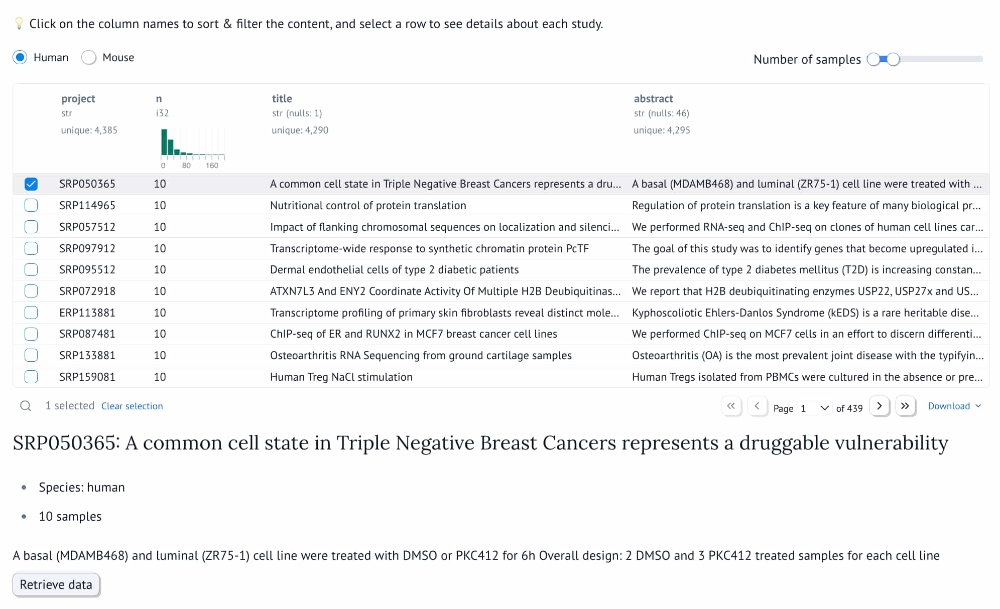
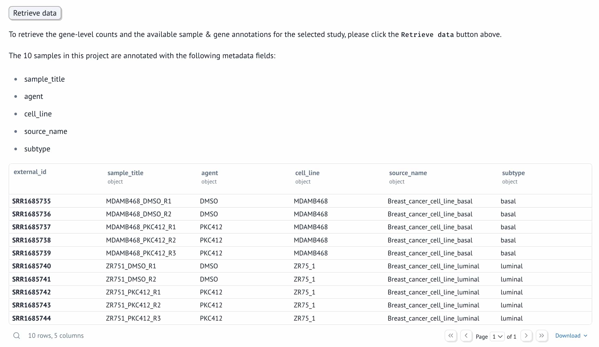
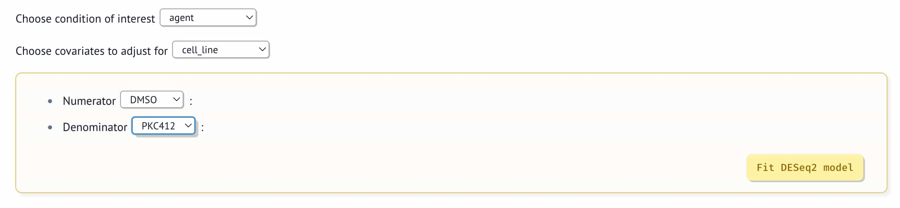
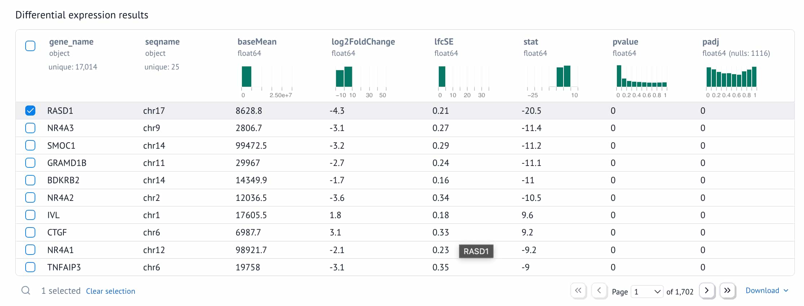
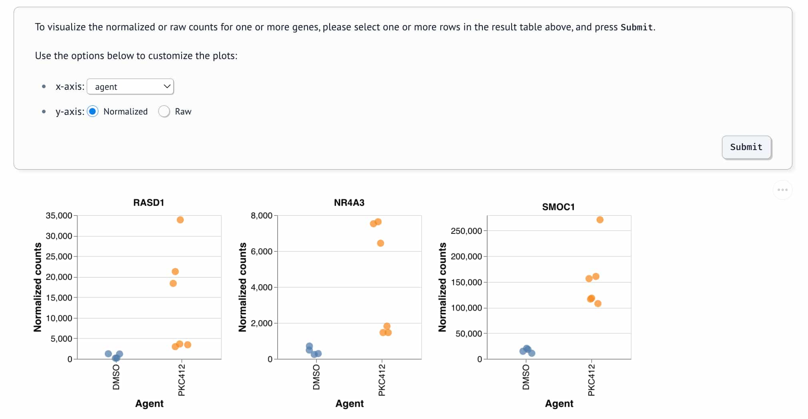

# ⛴️ mariner - a marimo notebook for differential expression analysis

This is my first project using the [marimo python notebook](https://marimo.io/) environment. 

To learn how to use marimo, both as a notebook and in the form of an app, I chose to
create a workflow that performs differential gene expression analysis of bulk RNA-seq 
data using the excellent [pydeseq2](https://pydeseq2.readthedocs.io/en/latest/index.html)
module[^1]. 

[^1]: `pydeseq2` is a reimplementation of the pioneering [DESeq2 R package](https://bioconductor.org/packages/release/bioc/html/DESeq2.html) and has been given [a stamp of approval](https://x.com/mikelove/status/1651542670785781763?s=20) by Michael Love, one of DESeq2's original authors.

## Data source

The [recount3 project](https://rna.recount.bio/) has processed and shared thousands of
publicly available human and mouse RNA-seq datasets. Details of the available projects, samples and
files is available in its [github repository](https://github.com/LieberInstitute/recount3-docs/tree/master/study-explorer). For my `mariner` project, I collated this metadata into a 
[duckdb database](https://github.com/tomsing1/mariner/blob/main/data/recount3.db), which is accessed via http from the notebook.

## Analysis steps

The notebook allows users to 

1. Browse RNA-sequencing projects curated by the [recount3](https://rna.recount.bio/) team & select a study of interest

  

2. Retrieve the raw counts, sample- and gene-annotations from recount3

  

3. Define up to two covariates of interest for differential expression analysis

  

4. Fit a generalized linear model using [pydeseq2](https://pydeseq2.readthedocs.io/en/latest/index.html) and extract p-values for a comparison of interest

  

5. Plot the raw or normalized gene expression counts for one or more genes of interest

  

## Prerequisites

- Python 3.12 or higher
- [uv](https://github.com/astral-sh/uv) installed

## Getting Started

1. Clone this repository:

   ```bash
   git clone https://github.com/tomsing1/mariner
   cd mariner
   ```

2. Run the marimo editor:

   ```bash
   uv run marimo edit src/app.py
   ```

3. Run the marimo app:

   ```bash
   uv run marimo run src/app.py
   ```

## Deployment

### Docker

To run the application via `docker`, first build a custom docker image using the
`Dockerfile`, and then run a container:

  ```bash
  docker build -t tomsing1/mariner .
  docker run -p 8080:8080 --rm -it tomsing1/mariner
  ```

You can reach the application at [localhost:8080](localhost:8080).

## Known limitations

- Some of the RNA-seq projects curated by recount3 are either very large (and take a
  long time to model) or are not associated with obvious covariates for modeling. For
  these studies, users likely want to download the data & annotations via the 
  [recount3 explorer](https://jhubiostatistics.shinyapps.io/recount3-study-explorer/) 
  and perform a custom analysis.
- Currently, only categorical covariates are supported by `pydeseq2`.
- Because not all of the python modules that are imported are available as pure python
  wheels today, the notebook cannot be deployed via webassembly (e.g. on 
  [marimo.io](https://marimo.io). Instead, you can run the notebook / app locally or on
  a server, e.g. using `docker`.
- The main goal of this project is educational - don't expect a fully functional
  application!

## Development

### Running Tests

```bash
# Run testing
uv run pytest tests
```

### Linting and formatting

```bash
uv run ruff check .
uv run ruff format .
```

## Project Structure

The project is based on the [marimo uv starter template](https://github.com/marimo-team/marimo-uv-starter-template)
and has the following structure:

```markdown
├── .github/           # GitHub Actions workflows
├── data               # Datasets
│   └── recount3.db    # duckdb metadata database
├── docs               # Documentation
│   └── images         # screenshots
├── scripts/           # Scripts
│   └── recount3.db    # R script used to create the duckdb database
├── src/               # Source code
│   └── app.py         # Sample marimo notebook
│   └── utils.py       # Sample marimo notebook
├── pyproject.toml     # Project configuration
├── tests/             # Test files
│   └── test_utils.py  # Unit test for the utils submodule
├── pyproject.toml     # Project configuration
├── uv.lock            # Dependency lock file
└── Dockerfile         # Instructions to build a docker image
```

## License

MIT
